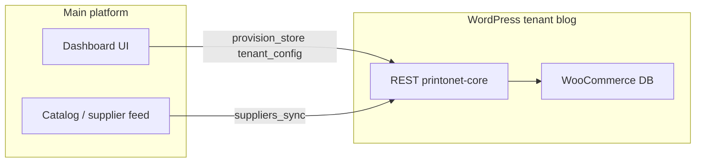

# WordPress DB vs dashboard: what is actually happening

## Short answer

**Data does hit the WordPress database** for this multitenant design, but **little of it is created through traditional wp-admin “building” flows**. The main platform and MU plugin treat WordPress as the **runtime store** (subsites, WooCommerce catalog rows, options), while the **dashboard** is often the **control plane**.

If products or settings looked missing at times, that was typically **pipeline/sync or routing bugs** (e.g. jobs targeting wrong blog, malformed supplier payload), not an architectural choice to bypass MySQL.

## What writes into WordPress today

| Area | How it gets into WP | Where it lives |
|------|---------------------|----------------|
| New store | `wpmu_create_blog`, user linkage, theme activation, branding | Multisite tables + per-blog `wp_*options` / theme mods |
| Branding / tenant settings | `POST /tenant/config` (and pull-sync) via [class-printonet-tenant-control.php](printonet-multitenant/wp-content/mu-plugins/printonet-core/includes/class-printonet-tenant-control.php) | `update_option(...)` e.g. `printonet_tenant_status`, `printonet_brand_*`, Woo options, layout JSON |
| Product catalog | Supplier sync → `upsert_simple_product` in [class-printonet-supplier-sync.php](printonet-multitenant/wp-content/mu-plugins/printonet-core/includes/class-printonet-supplier-sync.php) | `wp_posts` (`product`), post meta (`_sku`, prices, stock), media for images |

So: **orders, customers, and cart behavior** still use normal WooCommerce once shoppers use the storefront; **catalog rows** are intended to exist as real products in the DB after sync.

## Why it can *feel* like “nothing is built in wp-admin”

- **No manual product entry**: Merchants may never open **Products → Add** if the main platform is the source of truth and sync fills the catalog.
- **Config is API-driven**: Branding and flags live in options updated by signed APIs, not only by checking boxes in **Settings**.
- **Visibility**: Inspecting the **network** admin vs the **tenant** site’s database prefix matters; product counts are per `blog_id`.

## Future risk (the real one)

The fragile part is **not** “WordPress has no data” if sync works—it is **who owns edits**:

- If the main platform **re-syncs** and overwrites SKUs/prices/titles, **changes made only in wp-admin** can be lost unless you define rules (e.g. “platform wins”, “WP wins for field X”, “two-way sync”).
- If you add **more** main-platform screens without syncing down, WordPress and the platform can **drift**.

## Do you have to build custom edit pages on the main platform?

**No, that is not the only solution.** Common patterns:

1. **WordPress-first for merchant ops**  
   Give store admins **wp-admin / WooCommerce** for day-to-day catalog and content; main platform only provisions, pushes **defaults**, and periodic catalog sync with a clear **conflict policy**.

2. **Platform-first (what you have leaned toward)**  
   Main platform is canonical; WordPress is a **rendering + checkout engine**; merchant-facing “edit store” lives on the platform (or limited WP role).

3. **Hybrid**  
   Platform: identity, billing, **policy**, global catalog. WordPress: **merchandising** (categories, homepage blocks, optional local products) with selective sync fields.

## Recommendations so this is not an issue later

- **Document ownership**: For each entity (product, price, stock, branding, pages), state **source of truth** and **overwrite behavior** on sync.
- **Operational checks**: Monitor `wp_printonet_sync_jobs` and tenant `product` counts; alert on failed jobs (you already have status fields).
- **Merchant UX**: Decide explicitly: **either** train merchants on wp-admin for edits **or** invest in platform UI and **stop** treating wp-admin as authoritative for those fields.

No code changes are required to answer this question; next step is a **product decision** on edit ownership, then optional implementation (webhooks, selective sync, or “read-only catalog in WP” flags).
