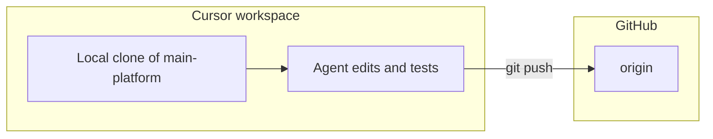

# Connect main-platform GitHub work to this Cursor session

## What is (and is not) possible

- **Possible:** I make edits, run tests, commit, and push **in any Git repo that exists on this machine** and is **inside the Cursor workspace** (or opened as the workspace).
- **Not automatic:** There is no separate “link GitHub” step that grants repo access without **git clone + credentials** (SSH key or HTTPS token) on this environment.

## Practical setups (pick one)

### Option A — Open main platform as its own Cursor project (simplest)

1. Clone the main-platform repo on this machine (same server or your dev box where Cursor runs).
2. In Cursor: **File → Open Folder** → select that repo root.
3. Start (or continue) a chat **with that folder as the workspace** — instructions apply only to files under that root.

**Pros:** Clean separation, no path confusion.  
**Cons:** You switch between two Cursor windows/projects for multitenant vs main platform.

### Option B — Multi-root workspace (both repos in one window)

1. Clone main-platform next to this repo (e.g. sibling directories).
2. Cursor: add both folders to a **multi-root workspace** (`.code-workspace`).
3. One chat can still bias toward a **primary** folder; be explicit which repo you mean (“change `main-platform/…`”).

**Pros:** Single window.  
**Cons:** Easy to edit the wrong repo unless paths are explicit.

### Option C — Monorepo / submodule (only if you want one Git history)

Move or submodule the multitenant engine under the main-platform repo (or the reverse). **Larger process** — only if you want long-term repo unification.

## GitHub authentication (required for push)

- **SSH:** Add deploy key or personal SSH key to GitHub; clone `git@github.com:org/repo.git`.
- **HTTPS:** Clone with PAT (stored via credential helper); pushes use the same.

Without one of these, I can still **read/edit locally** after you clone, but **push** will fail until auth is configured.

## Flow after setup

##What you need to provide (once)

- **Repo URL** (SSH or HTTPS).
- **Where** it should live on disk (path).
- **Auth method** you prefer (SSH vs PAT).

## Copy/paste between two AIs

Once main-platform is **this workspace** (or a root in a multi-root workspace), you don’t need to paste multitenant instructions into the “other” builder for cross-repo tasks — you’d paste **only** main-platform-specific context, or run everything in one project.

No code changes to [printonet-multitenant](.) are required for this; it is purely **workspace + git + clone** setup on your side (or on this host).
