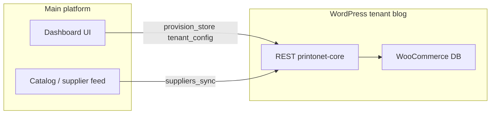
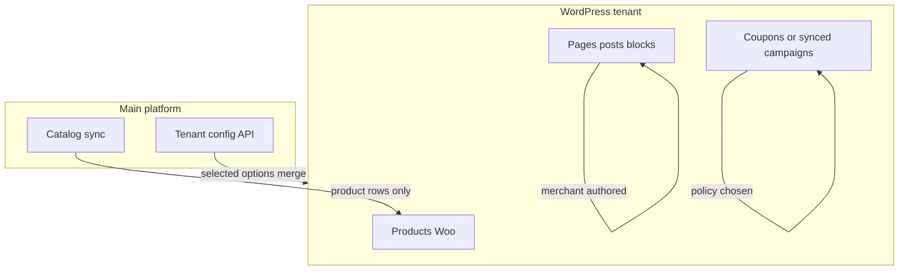

# WordPress DB vs dashboard: what is actually happening

## Short answer

**Data does hit the WordPress database** for this multitenant design, but **little of it is created through traditional wp-admin “building” flows**. The main platform and MU plugin treat WordPress as the **runtime store** (subsites, WooCommerce catalog rows, options), while the **dashboard** is often the **control plane**.

If products or settings looked missing at times, that was typically **pipeline/sync or routing bugs** (e.g. jobs targeting wrong blog, malformed supplier payload), not an architectural choice to bypass MySQL.

## What writes into WordPress today

| Area | How it gets into WP | Where it lives |
|------|---------------------|----------------|
| New store | `wpmu_create_blog`, user linkage, theme activation, branding | Multisite tables + per-blog `wp_*options` / theme mods |
| Branding / tenant settings | `POST /tenant/config` (and pull-sync) via [class-printonet-tenant-control.php](printonet-multitenant/wp-content/mu-plugins/printonet-core/includes/class-printonet-tenant-control.php) | `update_option(...)` e.g. `printonet_tenant_status`, `printonet_brand_*`, Woo options, layout JSON |
| Product catalog | Supplier sync → `upsert_simple_product` in [class-printonet-supplier-sync.php](printonet-multitenant/wp-content/mu-plugins/printonet-core/includes/class-printonet-supplier-sync.php) | `wp_posts` (`product`), post meta (`_sku`, prices, stock), media for images |

So: **orders, customers, and cart behavior** still use normal WooCommerce once shoppers use the storefront; **catalog rows** are intended to exist as real products in the DB after sync.

## Why it can *feel* like “nothing is built in wp-admin”

- **No manual product entry**: Merchants may never open **Products → Add** if the main platform is the source of truth and sync fills the catalog.
- **Config is API-driven**: Branding and flags live in options updated by signed APIs, not only by checking boxes in **Settings**.
- **Visibility**: Inspecting the **network** admin vs the **tenant** site’s database prefix matters; product counts are per `blog_id`.

## Future risk (the real one)

The fragile part is **not** “WordPress has no data” if sync works—it is **who owns edits**:

- If the main platform **re-syncs** and overwrites SKUs/prices/titles, **changes made only in wp-admin** can be lost unless you define rules (e.g. “platform wins”, “WP wins for field X”, “two-way sync”).
- If you add **more** main-platform screens without syncing down, WordPress and the platform can **drift**.

## Clarification: are we recommending main-platform UI for merchant edits?

**No — not as a universal requirement.** The plan is to **pick one model deliberately**, not to assume every change must be built in the main platform.

- **Main-platform UI** makes sense when: you want a single branded app, role-based access, audit logs, and the **main platform is the only source of truth** for catalog/branding (WordPress is a headless-style runtime + checkout).
- **WordPress (wp-admin) UI** makes sense when: you want to ship faster for merchant self-service, lean on WooCommerce’s built-in product/order tools, and accept **training merchants on WP** (with sync rules so platform pushes do not surprise them).
- **Hybrid** makes sense when: platform owns **policy and shared catalog**, but tenants customize **merchandising, pages, or local assortments** in WP—with explicit fields that sync never overwrites.

So: **we are not recommending “you must build all edit screens on the main platform.”** We *are* recommending that **somewhere** there is a clear story for “who edits what” (platform, WP, or split), so you do not end up with silent overwrites or drift.

### Decision (v1)

**Platform-first for catalog and tenant-wide policy:** the main platform is canonical for **supplier-driven products** (SKU, core pricing/stock rules as defined by sync) and for **API-pushed tenant options** where you choose to enforce consistency.

**WordPress-admin for CMS and merchandising surfaces:** merchants are **expected** to use wp-admin (or the Site Editor / theme-provided flows) for **pages, hero/banner content, navigation, and local promotions** that are not global catalog rows—provided you **draw a hard boundary** so scheduled sync and `POST /tenant/config` do not overwrite those surfaces.

Together this is **platform-first + hybrid content**: same stack, two ownership zones.

## Alternative operating model: you only “own” provision + product sync

**Scenario:** The multitenant platform **deploys** the store, **runs product sync** into WooCommerce, and offers **payment setup** (your aggregated payment vendor **or** the merchant’s own / BYO gateway). **Store customization** (theme, pages, heroes, merchandising, most Woo settings) is **the merchant’s responsibility**; your product obligation is **catalog correctness and availability**, not bespoke storefront work.

This is consistent with the architecture: WordPress remains the **tenant-operated storefront**; the platform is the **host + catalog pipeline + optional payments facilitator**.

### What you should still define in writing

| Topic | Platform typical responsibility | Merchant typical responsibility |
|-------|--------------------------------|----------------------------------|
| **Store creation, DNS, base theme** | Provision subsite, defaults, access URLs | Custom content, navigation, homepage |
| **Product catalog** | Sync SKUs, prices/stock per your rules | Not relying on manual product edits if sync overwrites them |
| **Payments** | If **platform vendor**: enable/configure per contract; if **BYO**: document connection steps, creds storage, **who is merchant of record** | Valid gateway account, webhooks, dispute handling per chosen model |
| **Compliance / PCI** | Depends on model: aggregated PSP vs BYO shifts liability and what you must certify | BYO: merchant + their PSP relationship |
| **Support** | Incidents in **sync jobs**, **provision APIs**, **your payment integration** | WP plugins, custom CSS, third-party themes, content bugs |

### Technical implications (so “merchant owns customization” is true)

- **`POST /tenant/config`**: Prefer **initial provisioning + optional policy flags** only, or **merge** updates that do **not** clobber merchant-controlled options/theme mods/layout. If you keep pushing full branding/layout from the platform after go-live, you are **not** hands-off on customization—you are still co-authoring the storefront.
- **Supplier sync**: Keep scoped to **products**; document that **manual product changes may be overwritten** if sync is authoritative—merchants customize **presentation**, not **canonical catalog fields**, unless you add local overrides.
- **Payment dual mode**: Implement as explicit tenant flags (e.g. `payment_mode: platform_psp | byo`) and Woo gateway configuration; ensure secrets for BYO live in **tenant-scoped** storage and are **never** overwritten by unrelated sync.
- **Monitoring**: Still your ops problem for **empty catalog / failed sync** (merchant will blame the store even if customization is theirs).

### How this relates to earlier UX choices

This model **does not** require main-platform UI for heroes/pages; it **expects** wp-admin (or agency) customization. It **reinforces** clear docs: **platform SLA = provision + catalog pipeline (+ chosen payment path)**; **merchant = everything else** unless you sell add-on managed services.

### Product tiers (decision)

Offer **two documented tiers** so expectations stay crisp:

| Tier | Platform scope | Merchant scope | `tenant/config` / sync behavior |
|------|----------------|----------------|----------------------------------|
| **A — Self-serve storefront** | Provision, **product sync**, payment mode (platform PSP or BYO), infra health | **All customization** (pages, heroes, theme, most Woo settings); support docs for wp-admin | **Bootstrap defaults** then **do not overwrite** merchant-controlled options/layout; sync **products only** |
| **B — Managed storefront** | Tier A plus **ongoing platform-driven branding/layout/policy** (or hands-on services) | Content/promos may still be wp-admin or partially platform UI per package | Platform may **continue pushing** agreed keys; ownership matrix + merge rules **per contract** |

Merchants on Tier A who need heroes/pages/promos use **wp-admin** (per earlier sections). Tier B is where **platform-first UI or aggressive config sync** is intentional, not accidental overlap.

#### Go-to-market default

**Lead with Tier A:** provision, **product sync**, payment mode (platform PSP or BYO), and infra/sync monitoring as the **standard** product story; merchant owns **all storefront customization** with written boundaries (bootstrap `tenant/config`, then no clobbering). **Tier B** is positioned as **managed storefront**—upsell, enterprise, or explicit contract—where ongoing platform-driven branding/layout is a **feature**, not an accidental overwrite of Tier A expectations.

## Plan when merchants edit in wp-admin (heroes, promotions, pages)

This is a normal extension of v1. The work is **policy + boundaries + merchant docs**, not “pick platform OR WordPress.”

### 1. Ownership matrix (document before scaling merchants)

| Surface | Recommended owner (this scenario) | Risk if unclear |
|---------|-----------------------------------|-----------------|
| **Products** (`product` post type, SKU/meta from supplier) | Platform / sync | Merchant edits in WC admin overwritten on sync unless you add “local override” rules |
| **Pages, posts, reusable blocks** | **WordPress** | Low conflict if sync never touches `page`/`post` |
| **Hero / homepage sections** | **WordPress** (Customizer, template parts, block patterns, or theme options **not** overwritten by API) | High if `tenant/config` or layout JSON **replaces** entire homepage structure each sync |
| **Menus** | **WordPress** | Same as above |
| **Media library** (banner images) | **WordPress** | Sync product images should only attach to products, not bulk-delete unrelated attachments |
| **Promotions** | Choose one: **Woo Coupons** / cart rules in WP **or** platform-owned campaigns pushed to WP | Drift if both places define promos with no precedence rule |

Add this table (or equivalent) to internal docs and a short **merchant-facing** guide: “Edit your homepage and pages here; don’t rely on manual product edits for catalog SKUs.”

### 2. Technical guardrails (what engineering must guarantee)

- **Scope supplier sync** to `product` (and product-linked meta/media). Audit [class-printonet-supplier-sync.php](printonet-multitenant/wp-content/mu-plugins/printonet-core/includes/class-printonet-supplier-sync.php) for any broad deletes or option writes that could hit content.
- **Scope `POST /tenant/config`** in [class-printonet-tenant-control.php](printonet-multitenant/wp-content/mu-plugins/printonet-core/includes/class-printonet-tenant-control.php): separate **platform-controlled keys** from **merchant-controlled keys**. Prefer **merge** for layout JSON (e.g. only update keys the platform owns) rather than replacing entire blobs—**if** merchants customize layout in WP-backed storage.
- **Theme contract**: define how heroes work (e.g. front page template + patterns, or dedicated options keys). If the theme reads hero config from **options**, decide whether those keys are **excluded** from platform pushes once the store is live.
- **Roles**: use **Shop Manager** / **Editor** caps so merchants can manage content without installing plugins or editing theme PHP.

### 3. Promotions — explicit product choice

- **WP-native:** WooCommerce coupons, sale prices on products (conflicts with sync if sync resets prices), or third-party promo plugins—document whether sale price is sync-managed.
- **Platform-native:** campaigns defined on main app, rendered via API or synced blocks into WP—more control, more build work.

Pick one **system of record** for “store-wide promo logic”; use the other only as display if needed.

### 4. Operational follow-up

Same as the rest of the plan: monitor sync failures and empty catalogs; add alerts so merchants are not “fixing” silent catalog issues only in wp-admin.

## Do you have to build custom edit pages on the main platform?

**No, that is not the only solution.** Common patterns:

1. **WordPress-first for merchant ops**  
   Give store admins **wp-admin / WooCommerce** for day-to-day catalog and content; main platform only provisions, pushes **defaults**, and periodic catalog sync with a clear **conflict policy**.

2. **Platform-first (what you have leaned toward)**  
   Main platform is canonical; WordPress is a **rendering + checkout engine**; merchant-facing “edit store” lives on the platform (or limited WP role).

3. **Hybrid**  
   Platform: identity, billing, **policy**, global catalog. WordPress: **merchandising** (categories, homepage blocks, optional local products) with selective sync fields.

## Recommendations so this is not an issue later

- **Document ownership**: For each entity (product, price, stock, branding, pages), state **source of truth** and **overwrite behavior** on sync.
- **Operational checks**: Monitor `wp_printonet_sync_jobs` and tenant `product` counts; alert on failed jobs (you already have status fields).
- **Merchant UX**: **Platform UI** for catalog/policy where you enforce consistency; **wp-admin** for pages, heroes, and (per decision) promotions—with written boundaries so nobody expects manual product edits to survive sync.
- **Implementation order**: (1) document ownership matrix + merchant guide, (2) audit sync/config code paths for accidental overwrites of pages/options, (3) align theme hero/homepage with “WP-owned” storage, (4) choose promo system of record.

Optional later: platform-built **page/banner builders** that push structured content to WP if you outgrow wp-admin UX—same ownership rules apply.
